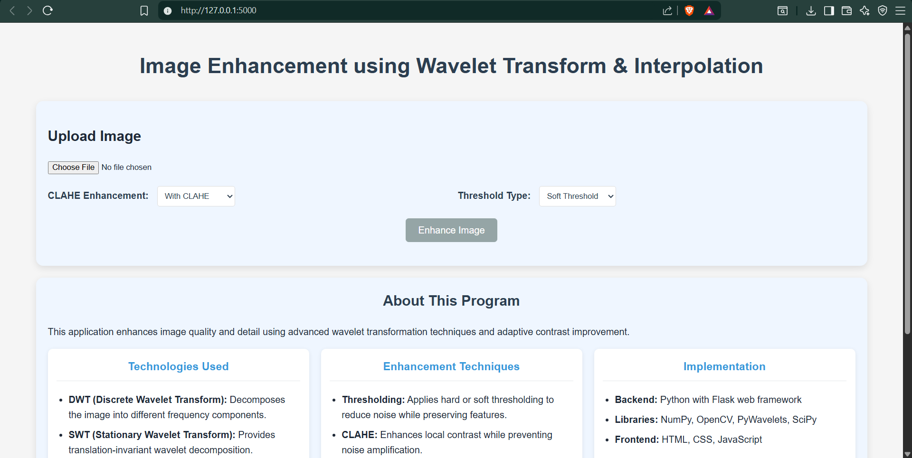
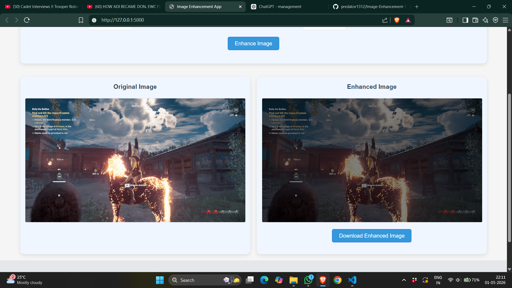

# Image Enhancement Tool

A web-based application that enhances image quality using wavelet transform, interpolation, and adaptive contrast techniques.

This project combines image processing with a simple web interface, allowing users to upload an image, apply enhancement methods, and instantly compare results.

---

## Preview




---

## Key Features

- Upload and process images directly in the browser  
- Wavelet-based image enhancement (DWT + SWT)  
- Noise reduction using hard and soft thresholding  
- Optional CLAHE for improved contrast  
- Side-by-side comparison of original and enhanced images  
- Download enhanced output  

---

## How it Works

The enhancement pipeline applies multiple steps:

- **Wavelet Transform** to break the image into frequency components  
- **Thresholding** to reduce noise while preserving details  
- **Interpolation** to improve resolution  
- **CLAHE** (optional) to enhance local contrast  

These techniques work together to produce a sharper and clearer image.

---

## Tech Stack

- Python (Flask)
- OpenCV
- NumPy
- PyWavelets
- SciPy
- HTML, CSS, JavaScript

---

## Getting Started

### Clone the repository

```
git clone https://github.com/predator1312/Image-Enhancement-Tool.git
```

### Navigate to the project folder

```
cd Image-Enhancement-Tool
```

### Install dependencies

```
pip install -r requirements.txt
```

### Run the application

```
python app.py
```

### Open in browser

```
http://127.0.0.1:5000
```

---

## Project Structure

```
Image-Enhancement-Tool/
│
├── app.py
├── requirements.txt
├── templates/
│   └── index.html
├── screenshots/
├── .gitignore
└── README.md
```

---

## Why this Project

This project was built to apply image processing concepts in a practical setting. It demonstrates how wavelet transforms and contrast enhancement techniques can be integrated into a real-world application with a user-friendly interface.

---

## Future Improvements

- Drag-and-drop image upload  
- Faster processing pipeline  
- Batch image processing  
- Deployment as a live web application  

---

## Author

Kushal Sharma  
Rajarajeswari College of Engineering
